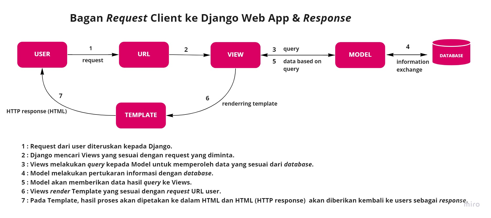

### Tugas 2 - Shafa Aleyda Tsabitah (2106634534)\_PBP F

## [Link Aplikasi Heroku](http://pbpshafa.herokuapp.com/katalog/)

## Bagan Request Client Django Web App beserta Responsenya & Kaitan antara urls.py, views.py, models.py, dan berkas html

**Model**

Model akan berperan sebagai *interface* atau tampilan dari data. Model bertanggung jawab dalam memelihara data. Satu model (model class) dipetakan ke satu tabel *database*. *Field* data pada Model akan dipetakan oleh Django ke *fiel*d data sesuai yang ada di *database*. 

Manipulasi data seperti *create, read, update,* dan *delete* (CRUD) data dapat dilakukan pada *database* dengan menggunakan *command* khusus yang dikenal dengan SQL. 

**View**

View merupakan bagian dari user *interface* yang berfungsi untuk menerima ***web request* dan mengembalikan *web response***. Eksekusi dari *business logic* juga merupakan salah satu fungsi dari View. *Response* yang diberikan dapat berupa isi konten HTML dari sebuah laman web, *redirect*, 404 error, ataupun hal lain yang dapat ditampilkan oleh web browser. 

**Template**

Template merupakan sebuah .html file yang umumnya ditulis menggunakan HTML, CSS, dan JavaScript. Template berperan untuk menyediakan *frontend* dan *layout* terhadap tampilan website. 

> Kaitan antara urls.py, views.py, model.py dan HTML pada bagan tersebut yaitu urls.py berperan sebagai module yang berfungsi untuk memetakan redirect requests dari project URLS ke app URLS dan mencari views yang sesuai. Pada module views.py terdapat fungsi yang dapat memetakan context ke HTML (template). Value dari context yang akan dipetakan diperoleh dengan menginisiasi objek dari model.py dimana objek tersebut akan berisi query set dari data-data hasil query Views terhadap Model. Model menyediakan data tersebut melalui information exchange dengan database. 
 
## Alasan menggunakan virtual environment? Apakah kita tetap dapat membuat aplikasi web berbasis Django tanpa menggunakan virtual environment

- *Virtual environments allow you to isolate your projects*

Setiap projects memiliki librarynya masing-masing sehingga ketika ingin melakukan perubahan di salah satu library pada project maka tidak akan mempengaruhi keseluruhan library pada project yang lain. 
- *Upgrade* pada project apabila dilakukan pada virtual environment tidak akan mengganggu project yang sudah memasuki fase *running*. 

Pembuatan web app berbasis Django bukan merupakan sebuah obligasi sehingga tetap memungkinkan untuk membuat web app berbasis Django tanpa menggunakan virtual environment. Namun, pembuatan web app berbasis Django menggunakan virtual environment dapat dikatakan sebagai langkah *best practice*. 

